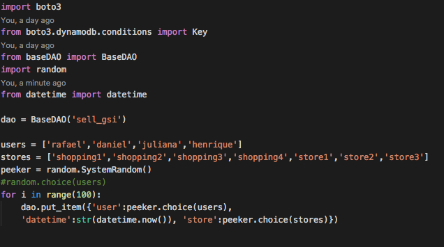
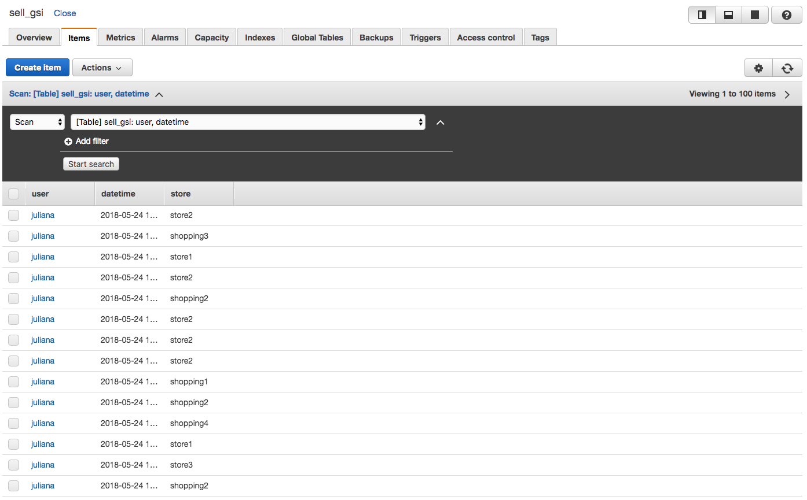
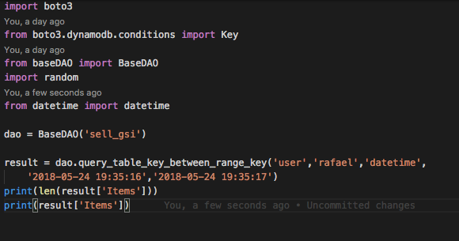

# 03.4 - Global Secondary Key

1. Crie uma table chamada sell_gsi
2. Nessa tabela vá até a aba 'Indexes', e clique em 'Create Index'.

3. Preencha como a imagem, e clique em 'Create Index'. Esse processo pode demorar.

4. Altere o arquivo 'dynamo.py' para que fique como na foto

5. Execute o arquivo com o comando `python3 dynamo.py`

6. Altere o arquivo 'dynamo.py' para que fique como na foto, escolhendo um invervalo valido de um segundo para o usuario pesquisado

7. Execute o arquivo com o comando `python3 dynamo.py`
8. Altere o arquivo 'dynamo.py' para que fique como na foto, escolhendo um invervalo valido de um segundo para a loja pesquisado

9. Execute o arquivo com o comando `python3 dynamo.py`
