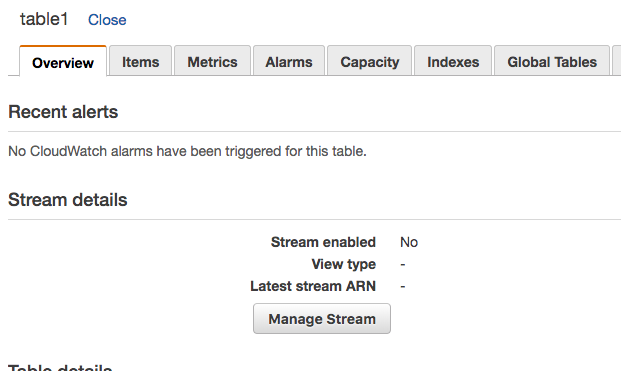
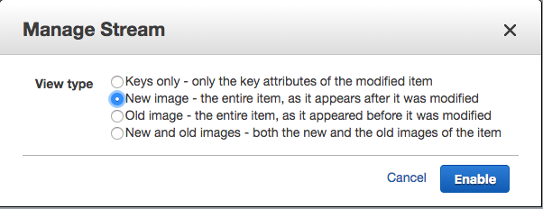
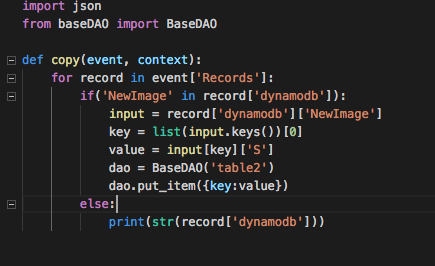
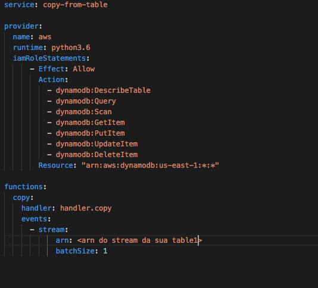
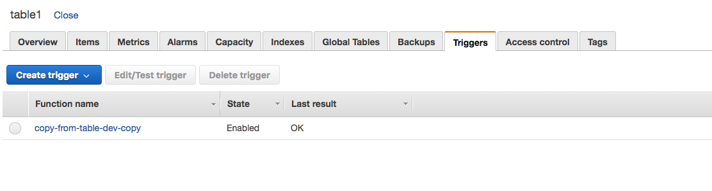

# 03.5 - Dynamo Streams

1. Crie 2 tabelas, table1, e table2 com a mesma partition key.
2. Na table1, na aba 'Overview', clique em 'Manage Stream'

3. Escolha a opção 'New Image', e clique em 'Enable'

4. crie uma pasta chamada 'lambda' e entre nela
5. rode o comando `sls create --template "aws-python3"`
6. copie o arquivo 'baseDAO.py' que esta na raiz do módulo para esse diretório.
7. Edite o arquivo 'handler.py' para que fique como na imagem

8. Edite o arquivo 'serverless.yml' para que fique igual na imagem

9. Execute o comando `sls deploy` dentro da pasta 'lambda'
10. Verifique no painel da 'table1' se existe uma trigger atribuida ao Stream
 
11. Dentro da para 'lambda' execute o seguinte comando para seguir o log da função criada `sls logs -t -f copy`
12. Altere o arquivo 'dynamo.py' na raiz do módulo para inserir 10 linhas na 'table1'
13. Em outra aba do terminal rode o arquivo 'dynamo.py' com o comando `python3 dynamo.py`
14. Caso tudo tenha dado certo todos as linhas inseridas na 'table1' também vão estar na 'table2'
